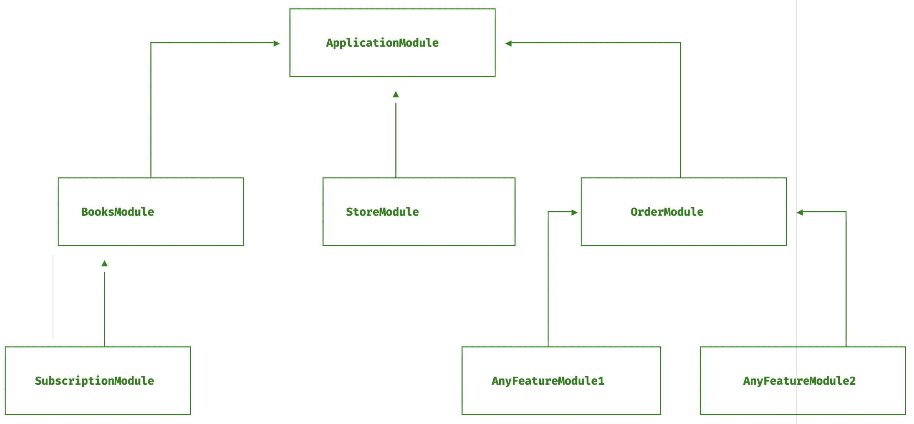

A module is a class annotated with a `@Module()` decorator. 
The `@Module()` decorator provides **metadata** that **Ellar** makes use of to organize the application structure.



The `ApplicationModule` is the entry point for Ellar to build your application graph - 
the internal data structure used to resolve module and provider relationships and dependencies.
The best way to organize your components is to build your projects as `Modules`. 
Thus, the architecture resulting from most applications will include multiple modules with closely related **functionality**.

## `Feature modules`
Module helps to organize code relevant for specific features, ensuring that the code is clear and organized.
This will help to manage complexity and develop using SOLID especially as the application or team grows.

A typical example of a feature module is the **dogs** project. The `DogsModule` wraps all the services and controller
that manages the dog resource which makes it easy to maintain and extend.

```python
# project_name/apps/dogs/module.py

from ellar.common import Module
from ellar.core import ModuleBase
from ellar.di import Container
from .services import DogsRepository
from .controllers import DogsController


@Module(
    controllers=[DogsController],
    providers=[DogsRepository],
)
class DogsModule(ModuleBase):
    def register_providers(self, container: Container) -> None:
        # for more complicated provider registrations
        # container.register_instance(...)
        pass
```

## `Module Parameters`
Let's create a Module and take a quick overview of its parameters.

```python
from ellar.common import Module
from ellar.core import ModuleBase

@Module(
    name='', 
    modules=[], 
    providers=[],
    controllers=[],
    routers=[],
    commands=[],
    base_directory=None, 
    static_folder='static', 
    template_folder='template'
)
class BookModule(ModuleBase):
    pass

```

|                   |                                                                                                                              |
|-------------------|------------------------------------------------------------------------------------------------------------------------------|
| `name`            | name of the module - it's irrelevant at the moment.                                                                          |
| `modules`         | List of Module dependencies                                                                                                  |
| `providers`       | the providers that will be instantiated by the Ellar injector and that may be shared at least across this module             |
| `controllers`     | the set of controllers defined in this module which have to be instantiated                                                  |
| `routers`         | the set of `ModuleRouter` defined in this module                                                                             |
| `commands`        | the set of `EllarTyper` or `command` decorated functions                                                                     |
| `base_directory`  | root directory for this module to read `static_folder` and `template_folder`. Default is the root folder of the Module Class |
| `static_folder`   | defines the static folder for this module                                                                                    |
| `template_folder` | defines the template folder for this module                                                                                  |


## `Additional Module Configurations`
### `Module Events`
Every registered Module receives two event calls during its instantiation and when application is ready.

```python
from ellar.common import Module
from ellar.core import ModuleBase, Config, App

@Module()
class ModuleEventSample(ModuleBase):
    @classmethod
    def before_init(cls, config: Config) -> None:
        """Called before creating Module object"""
    
    def application_ready(self, app: App) -> None:
        """Called when application is ready"""

```
`before_init` receives current app `Config` as a parameter and `application_ready` function receives `App` instance as parameter.

### `Module Exceptions`
In Ellar, custom exceptions can be registered through modules. 
During module meta-data computation, Ellar reads additional properties such as these from registered modules

```python
from ellar.common import Module, exception_handler
from ellar.core import ModuleBase, JSONResponse, Request, Response

@Module()
class ModuleExceptionSample(ModuleBase):
    @exception_handler(404)
    def exception_404_handler(cls, request: Request, exc: Exception) -> Response:
        return JSONResponse(dict(detail="Resource not found."))
```
`exception_404_handler` will be register to the application at runtime during `ModuleExceptionSample` computation.

### `Module Templating Filters`
We can also define `Jinja2` templating filters in project Modules or any `@Module()` module.
The defined filters are be passed down to `Jinja2` **environment** instance alongside the `template_folder` 
value when creating **TemplateLoader**.

```python

from ellar.common import Module, template_global, template_filter
from ellar.core import ModuleBase

@Module()
class ModuleTemplateFilterSample(ModuleBase):
    @template_filter()
    def double_filter(cls, n):
        return n * 2

    @template_global()
    def double_global(cls, n):
        return n * 2

    @template_filter(name="dec_filter")
    def double_filter_dec(cls, n):
        return n * 2
```
### `Module Request Events`
During application request handling, application router emits two events `start_up` and `shutdown` event.
We can subscribe to those events in our modules. 
```python

from ellar.common import Module, on_shutdown, on_startup
from ellar.core import ModuleBase

@Module()
class ModuleRequestEventsSample(ModuleBase):
    @on_startup
    def on_startup_func(cls):
        pass
    
    @on_startup()
    async def on_startup_func_2(cls):
        pass
    
    @on_shutdown
    def on_shutdown_func(cls):
        pass
    
    @on_shutdown()
    async def on_shutdown_func_2(cls):
        pass
```
These will be registered to the application router during `ModuleRequestEventsSample` computation at runtime.
Also, the events can be `async` as in the case of `on_shutdown_func_2` and `on_startup_func_2`


## `Dependency Injection`
A module class can inject providers as well (e.g., for configuration purposes):

For example, from our sample project, the can inject `Config` to the `DogModule`
```python
# project_name/apps/dogs/module.py

from ellar.common import Module
from ellar.core import Config, ModuleBase
from ellar.di import Container
from .services import DogsRepository
from .controllers import DogsController


@Module(
    controllers=[DogsController],
    providers=[DogsRepository],
)
class DogsModule(ModuleBase):
    def __init__(self, config: Config):
        self.config = config
    
    def register_providers(self, container: Container) -> None:
        # for more complicated provider registrations
        # container.register_instance(...)
        pass
```


## `Injector Module`
Since `EllarInjector` is based on a python library [injector](https://injector.readthedocs.io/en/latest/index.html) both 
share similar `Module` features with few distinct features. As an added support, you can create or reuse modules from `injector` Modules.

!!! info
    This type of module is used to configure `injector` **bindings** and **providers** for dependency injection purposes.

```python
from ellar.core import ModuleBase
from ellar.di import Container
from injector import provider


class Name(str):
    pass


class Description(str):
    pass


class ExampleModule(ModuleBase):
    def register_services(self, container: Container) -> None:
        container.bind(Name, to='Sherlock')

    @provider
    def describe(self, name: Name) -> Description:
        return Description('%s is a man of astounding insight' % name)

```
The `ExampleModule` has registered `Description` and `Name` type to the injector and can be resolved respectively if required by any object.

Read more on injector module use cases - [Here](https://injector.readthedocs.io/en/latest/terminology.html#module).
